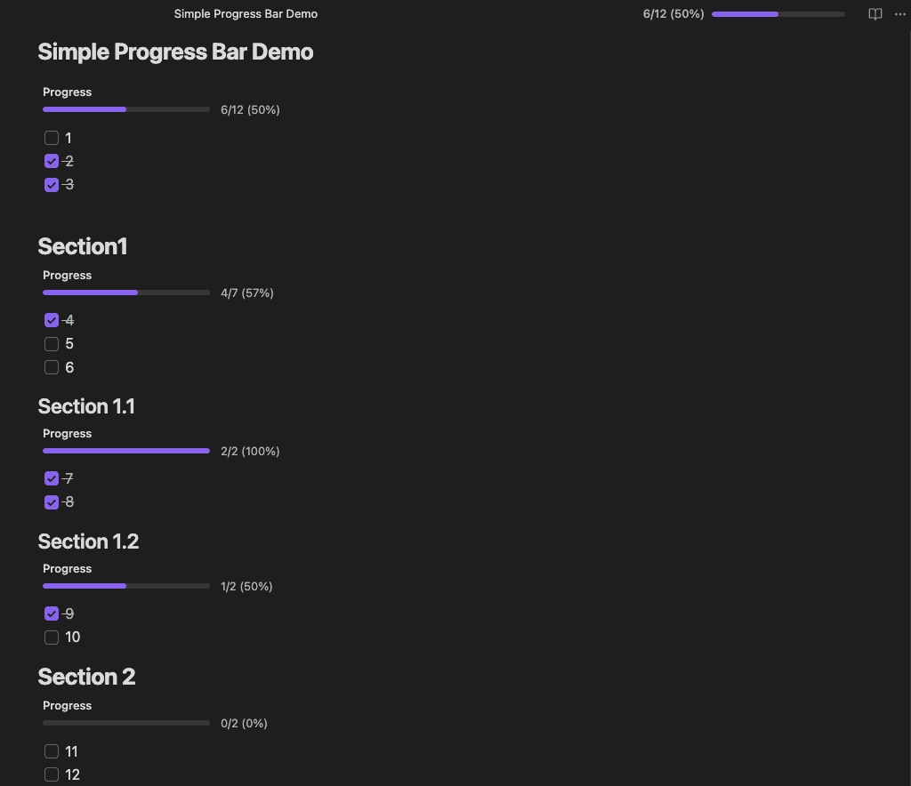

# Simple Progress Bar

A minimal and elegant Obsidian plugin that visualizes your checkbox completion with beautiful progress bars.



## Features

### Note Progress Bar
Displays a clean progress bar in the note header showing completion for all checkboxes in the current note. Updates in real-time as you check off tasks.

### Section Progress Bar
Track progress for specific sections using embedded progress bars. Simply add a code block:

````markdown
```sp-bar
Progress
```
````

The section progress bar automatically counts checkboxes within the same heading section.

## Usage

### Automatic Note Progress
The note progress bar appears automatically in the header when your note contains checkboxes:

```markdown
- [ ] Task 1
- [x] Task 2
- [x] Task 3
```

### Embedded Section Progress
Add progress tracking to specific sections:

```markdown
## Section 1

```sp-bar
Progress
```

- [ ] Task A
- [x] Task B
- [ ] Task C
```

The embedded bar will show: `2/3 (67%)`

## Settings

- **Show note progress bar** - Toggle the note progress bar on/off
- **Show ribbon icon** - Add a toggle button to the left sidebar

## Commands

- **Toggle Note Progress Bar** - Quickly show/hide the note progress bar via command palette

## Installation

### Manual Installation
1. Download the latest release
2. Extract files to `<vault>/.obsidian/plugins/simple-progress-bar/`
3. Reload Obsidian
4. Enable the plugin in Settings → Community plugins

### Development
See [DEVELOPMENT.md](DEVELOPMENT.md) for instructions on building and testing locally.

## Features at a Glance

- Clean, minimal design that adapts to your theme
- Real-time updates as you check/uncheck tasks
- Note-wide progress tracking in the header
- Section-specific progress bars via code blocks
- Customizable label text for embedded bars
- Zero configuration required

## Known Issue

- If a note begins immediately with an `sp-bar` code block on the first line, Obsidian keeps that block in edit mode and skips our processor. As a temporary workaround, the plugin will automatically insert a leading blank line for such notes so the bar renders. This is applied in-memory when the note loads; no other content is modified.

## Support

Found a bug or have a feature request? [Open an issue](https://github.com/pochihh/obsidian-simple-progress-bar/issues)

## License

MIT