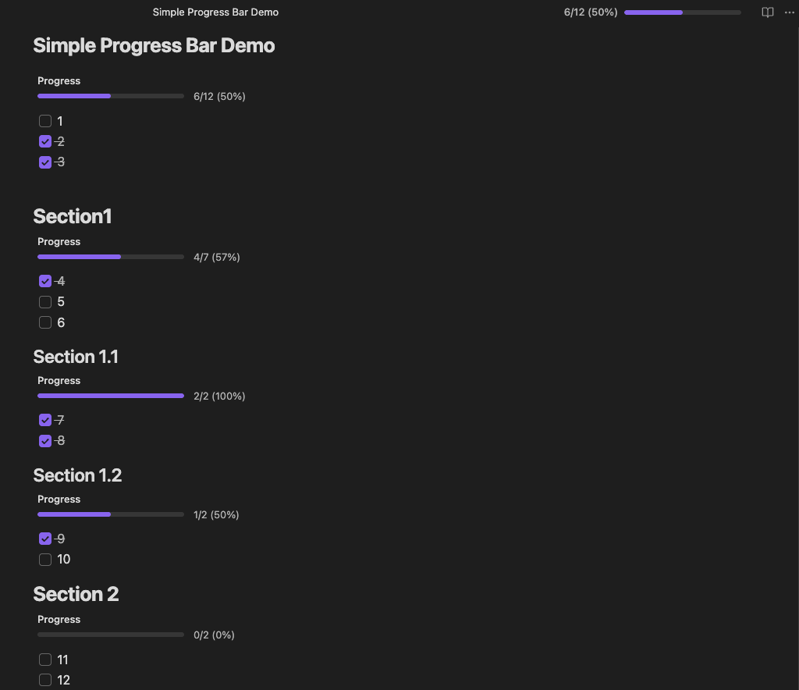
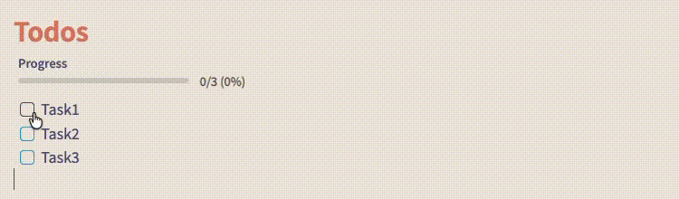
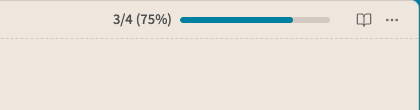

# Simple Progress Bar

A minimal and elegant Obsidian plugin that visualizes your checkbox completion with beautiful progress bars.

<!--  -->

## Features
### Section Progress Bar

Track progress for specific sections using embedded progress bars. Simply add a code block:

````markdown
```sp-bar
[YOUR TEXT]
```
````

The section progress bar automatically counts checkboxes within the same heading section.

### Note Progress Bar
Displays a clean progress bar in the note header showing completion for all checkboxes in the current note. Updates in real-time as you check off tasks.


## Usage

### Automatic Note Progress
The note progress bar appears automatically in the header when your note contains checkboxes:

```markdown
- [ ] Task 1
- [x] Task 2
- [x] Task 3
```

### Embedded Section Progress
Add progress tracking to specific sections:

````markdown
## Section 1
```sp-bar
Progress
```

- [ ] Task A
- [x] Task B
- [ ] Task C
````

The embedded bar will show: `2/3 (67%)`

## Settings

- **Show in note header** - Toggle the note progress bar on/off.

## Commands

Use these exact commands from Obsidian's command palette:

- **Simple Progress Bar: Insert inline progress bar** - Insert an `sp-bar` code block at the cursor. If text is selected, it becomes the progress bar label.
- **Simple Progress Bar: Toggle note progress bar** - Quickly show/hide the note progress bar.
- **Simple Progress Bar: Show note progress bar** - Show the note progress bar.
- **Simple Progress Bar: Hide note progress bar** - Hide the note progress bar.

## Installation

### Manual Installation
1. Download the latest release
2. Extract files to `<vault>/.obsidian/plugins/simple-progress-bar/`
3. Reload Obsidian
4. Enable the plugin in Settings → Community plugins

### Development
See [DEVELOPMENT.md](DEVELOPMENT.md) for instructions on building and testing locally.

## Troubleshooting

If the 100% completion animation does not play, or a local build looks stale after copying files, see [TROUBLESHOOTING.md](TROUBLESHOOTING.md).

## Features at a Glance

- Clean, minimal design that adapts to your theme
- Real-time updates as you check/uncheck tasks
- Note-wide progress tracking in the header
- Section-specific progress bars via code blocks
- Customizable label text for embedded bars
- Zero configuration required

## Known Issue

- Obsidian may delay re-rendering a freshly edited `sp-bar` code block until the note view refreshes. If an embedded bar does not appear immediately after editing the code block itself, switch notes or toggle reading/source mode once.

## Support

Found a bug or have a feature request? [Open an issue](https://github.com/pochihh/obsidian-simple-progress-bar/issues)

## License

MIT